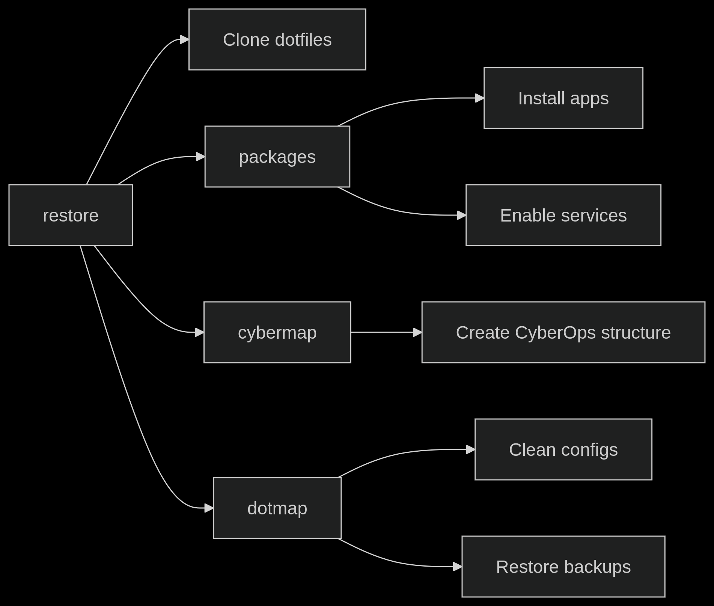

# ChaosMapper

> When nothing goes right....  Go left

ChaosMapper is a toolkit that provides a comprehensive solution for restoring and configuring an Arch-based cybersecurity workspace. The restoration process is orchestrated by the main `restore` script, which coordinates several specialized scripts to recreate complete Hyprland working environment.

### Key Components:
1. **`restore`** - Master restoration script
2. **`cybermap`** - Cybersecurity workspace organizer
3. **`dotmap`** - Dotfile/config manager
4. **`packages`** - Package and service installer

---

## Workflow Diagram


---

## Script Details

### 1. `restore` - System Restoration Master
**Purpose**: Initializes system restoration by cloning End-4 dotfiles for Hyprland and orchestrating other scripts  
**Features**:
- Verifies system dependencies (git, pacman)
- Installs essential build tools
- Clones dotfiles repository
- Executes other restoration scripts in sequence

**Usage**:
```bash
./restore
```

**Options**:
- None (automated workflow)

**Sample Output**:
```
📦 Starting System Restoration
--------------------------------
[ℹ] Cloning dotfiles repository...
[✓] Dotfiles cloned successfully
[ℹ] Running package installation...
...
[✓] System restoration complete!
Reboot now? [Y/n]
```

---

### 2. `cybermap` - Cybersecurity Workspace Organizer
**Purpose**: Creates structured directory hierarchy for cybersecurity operations  
**Features**:
- Creates categorized workspace (Red Team/Blue Team/Threat Intel/etc.)
- Handles 40+ specialized directories
- Customizable base path via environment variable
- Visual progress tracking with category icons

**Usage**:
```bash
# Default location (~/CyberOps)
./cybermap

# Custom location
CYBEROPS_BASE="/path/to/workspace" ./cybermap
```

**Sample Structure**:
```
CyberOps/
├── Red_Team
│   ├── Engagements
│   ├── Tools
│   └── Payloads
├── Blue_Team
│   ├── IR_Cases
│   └── Detection_Engineering
└── Threat_Intel
    ├── Feeds
    └── IOCs
```

---

### 3. `dotmap` - Configuration Manager
**Purpose**: Manages dotfiles and configuration restoration  
**Features**:
- Cleans existing configurations
- Restores from backup directory
- Permission correction
- Dry-run mode for safety
- Interactive confirmation

**Usage**:
```bash
# Basic restoration
./dotmap

# Preview changes without applying
./dotmap --dry-run

# Automated mode (no confirmations)
./dotmap --yes
```

**Important**:
1. Place backups in `./BackUps` directory
2. Backups should mirror home directory structure:
   ```
   BackUps/
   ├── .config/
   │   └── hypr/
   └── .local/
       └── share/
   ```

---

### 4. `packages` - Package Installer
**Purpose**: Installs applications and activates system services  
**Features**:
- Adds BlackArch repository for easy access to security tools
- Installs packages from official repos and AUR
- Categorized installation (IDE/Communication/Gaming/etc.)
- Service activation with status verification
- Automatic dependency handling
- Comprehensive error tracking

**Package Categories**:

| Category      | Packages                             |
| ------------- | ------------------------------------ |
| IDE           | vscodium, obsidian                   |
| Communication | vesktop, telegram-desktop            |
| Gaming        | xmcl, cachyos-gaming-meta            |
| Utilities     | ranger, yt-dlp, mpv-mpris, fastfetch |
| System        | asusctl, supergfxctl                 |

**Usage**:
```bash
./packages
```

---

## Typical Workflow
1. **Initial Restoration**:
   ```bash
   ./restore
   ```
   
2. **Verify Operations**:
   - Check script summaries
   - Review created directories (`~/CyberOps`)
   - Confirm restored configs (`~/.config`)

3. **Manual Customization**:
   - Review installed packages
   - Adjust service configurations
   - Add custom tools to CyberOps workspace

4. **Reboot** (recommended):
   ```bash
   sudo reboot
   ```

---

## Troubleshooting
**Common Issues**:
- **Missing Dependencies**: Ensure `yay` is installed before running `packages`
- **Permission Errors**: Run scripts as regular user (not root) with sudo access
- **Backup Not Found**: Place backups in `./BackUps` relative to `dotmap`

---

## License
MIT License - Free for personal and professional use  
**Disclaimer**: Use at your own risk. Always test in non-critical environments first.